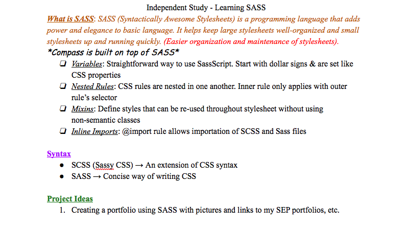

# Entry 1: Intro / Plan

For the past week, I have been looking into what topic I would be most interested in learning about for the next 9 weeks in my Software Engineering Program. I had to find a topic that would both grab my attention and one that I can be creative with. My ultimate goal is to create something that will be useful to either myself or to the general public. As I was doing my research on topics, I was drawn to Ruby on Rails because I had just finished my attempt on creating my own application with my knowledge on MVCs (Model-View-Controller). Ruby on Rails is a framework that delves in deeper to what ruby is capable of doing on the backend of an application. I turned this idea down because I had trouble with simple Ruby, so learning a more advanced type of Ruby would not seem like the smartest idea. I then had the idea to learn Firebase. Firebase is a way to make your application a little more user friendly (interactive). I turned this idea down because I did not feel like I could create something of much use to myself or to others within a matter of 9 weeks. I then stumbled upon an amazingly-named programming language called SASS.

## What is SASS?

Syntactically Awesome Stylesheets (SASS) is a programming language that adds power an elegance to basic language. What it basically does is it makes regular CSS more consice and organized. It is a way for programmers to easily maintain the style to whatever it is that they are making. It has elements such as inline imports, nested rules, mixins, and variables. Inline imports is a way for SCSS and SASS to be imported into your code. SCSS (Sassy CSS) is an extention of CSS. When you use mixins, it allows you to define variables that can be re-used throughout the stylesheet in an efficient way. Nested rules are CSS rules nested in one another. Using variables is a straightforward way to use SassScript. You use dollar signs to make them and they are set like CSS properies. 

## Why SASS?

The reason why I chose SASS was because I felt like it was the perfect balance for me regarding something being a challange and a programming language that I can create something useful with. With SASS, I can be able to style any kind of project I want to create with concise and efficient CSS code. Giving a project personality and individuality is important because that is what makes the project stand out. Uniqueness is one of the many things that makes a project worth looking at. I feel if I learn this type of programming language, I will be able to have the upper hand on other projects because of the way my project will be presented to the public. And when others look at my stylesheets, it will seem organized and effortless.

## This Week's Takeaways

## My Plan for the Next 9 Weeks (Project Ideas)

For this first week, I spent most of my time researching a programming language. When I found SASS, I created a Google Doc to put some basic information about SASS together.

For week 2 and 3, I plan on reading documentation for SASS on its website and on any other websites that I find that can be useful to my learning. I also plan on watching some YouTube videos that will give me basic information on how SASS works. This week is meant for me to gather some basic information and take notes on the language. Week 4 and 5 is going to be all Codecademy. This way, I can learn how to properly use the code and see what the code is capable of. For week 6, I want to go back to the SASS website and read the Learn section of their documentation. This week will be reserved for tinkering. Week 7 and 8 is going to be coding my big project. I plan on creating a github page that becomes my portfolio. This is helpful for me because I can have all of my information in one area that anyone in the professional world can look at. I am excited and looking forward to learning SASS.

Next

[Table of Contents](../README.md)