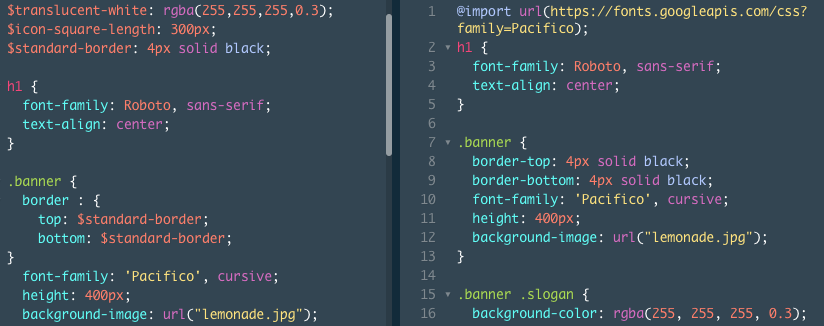

# Entry 3: Codecademy

For week three, I had a hard time. This was the week I was dreading only because of my personality. I do not grasp information very well and I take too much time on one small thing which evidently hurts me in the end. I also know that I am not the type of person who does well on doing things on my own or deals with time management well. When I was reading the SASS documentation on their website, I was finding that it was not that helpful for me. The information was not making sense to me and I was not sure how to test it out. I found that it was best for me to skip to codecademy for this week so I could start picking up some basic topics of SASS. 

## SCSS vs. CSS

When I first started the CSS codecademy, I did not understand what SCSS was and how it pertained to SASS. I then realized that SCSS is the syntax of SASS (I found this out by googling!). The difference between SCSS and CSS is the efficiency. 
For example: 
+ As you can see, if you take a look at ```.banner```, the SCSS file uses variables that can be reused to keep the code D.R.Y.
+ It also uses nesting which is a great tool SCSS has that allows you to work on one aspect and style it just like you see in the ```border``` section of the ```.banner```. 

## Next Steps

+ Finish codecademy in a timely manner and keep tinkering!
+ Watch the [Youtube](https://www.youtube.com/watch?v=P1G4_zxOxtk) video that I found. I figured out that I learn best by doing as well as learning from someone else. I am hoping that this video gives me more ideas on projects and helps explain more things about me. The more I hear something, the better/easier I retain the information. 

## Takeaways

+ Plan accordingly! Do not spend too much time on one resource. There are plenty out there that can be very helpful to the topic that you are trying to learn. 
+ Find what works for you. This bullet point pertains to the previous one meaning if you spend too much time on something that you are just not understanding, move on. (This is essential! Know when to go in a different direction to "unstuck" yourself).
+ Code along. If you are doing something like codecademy, tinker a little bit with it. Build something small to see if you are truly understanding what you are learning. 


[Previous](../entries/entry02.md) |  Next

[Table of Contents](../README.md)