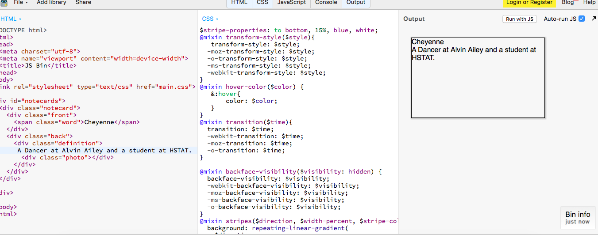

# Entry 5: Planning for final Project
This week was a pretty rough week because I seem to hit a road block. I was not understanding how to actually try SASS. I tried to re-create a mini SASS project in JS Bin, however the SCSS was not reading on the output. 
I thought to myself that maybe JS Bin was not the best place to tinker with SASS. This confused me and I did not know where to go from here. I then decided to google "do I need both a .css and a .scss file?". When I came to the conlusion hat my answer was no after doing a little research, I looked up "how to output SCSS on an HTML file". I came to a website that discussed downloading something called compass. 

## Installing Compass 
On this very helpful [website](https://community.c9.io/t/compile-scss-to-css/8260/2), I followed step by step instructions to install compass. 

1. First in my workspace I typed in my terminal cd .c9
2. Then I had to create a new directory called builders
3. After this, I cd into this directory and then create a compass.build file
4. In this file, I type in this: 
```
{
    "cmd" : [
        "bash",
        "--login",
        "-c",
        "compass compile /home/ubuntu/workspace/path/to/theme"],
    "env" : {},
    "info" : "Compiling SASS w/Compass ...",
    "selector": "source.scss"
}
```
5. Finally, when I am ready to create my project in Cloud 9, I go to Run, build system, and click on compass into that directory so that the SCSS is read as CSS. 

## Next Steps
1. Start coming up with more ideas for my final project.
2. Set up the files I need for my project and make sure they work together

## Take Aways
+ Read others blog entries, especially ones that pertain to your topic. If you are stuck or do not have an idea of where you should be, remember that your fellow classmates are also learning on their own and what they are learning can be useful to you. 
+ Do not overwhelm yourself. While independent study can be stressful, there is always a way to get unstuck. Use all the resources you can think of available to you to help you. 


[Previous](../entries/entry04.md) |  [Next](../entries/entry06.md)

[Table of Contents](../README.md)