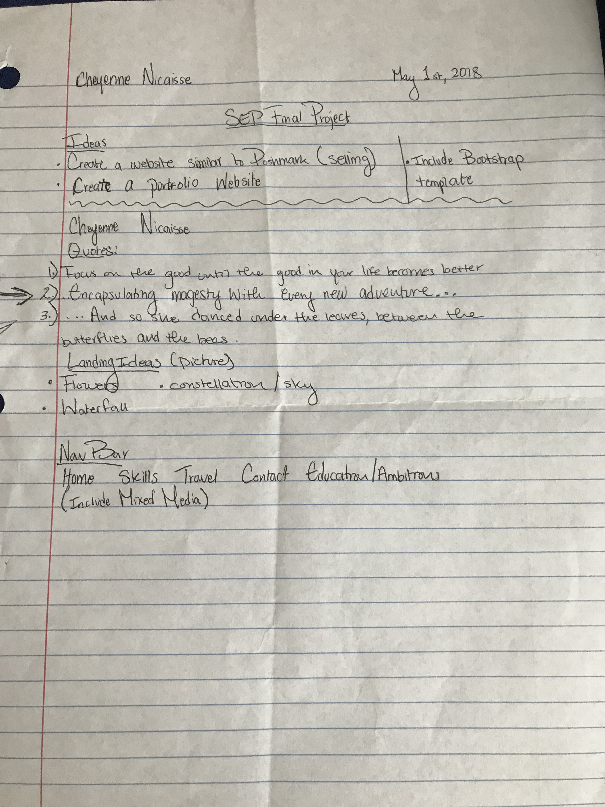

# Setting Up the Final Project
This week was tough in regards to actually starting this big project. For the first couple of days, I spent my time actually thinking about what it was I wanted to build and how it would look. So, I jotted down some basic ideas that I was thinking so I at least have something to follow. 

## Next Steps
1. Continue working on my MVP (the basic idea of what I want my website to look like).
2. Look at some examples of websites that utilize SASS so I can find some inspiration. 

## Takeaways
+ It is imperitive that you create a layout of whatever you are trying to do or make. This way you are not diving in head first into something as big as this project. Know what you are going to do and plan it out so you have some kind of structure or idea.
+ Use all of your resources. Look back at old projects or notes that could be beneficial to what you are trying to make. For example, since I am attempting to create a website, I am looking at previous websites I have built to help guide me.

[Previous](../entries/entry05.md) |  [Next](../entries/entry07.md)

[Table of Contents](../README.md)