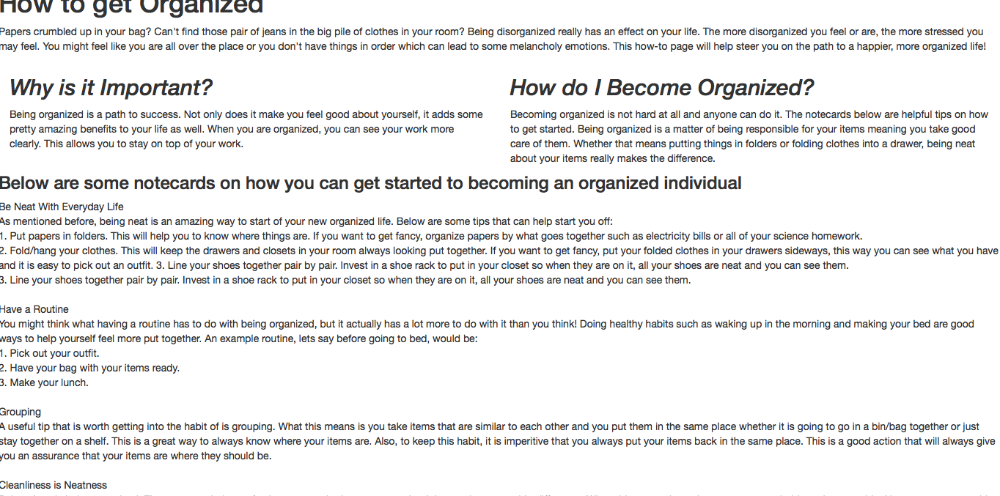

# Entry 7: Going Back and Forth

This week might have been the hardest week by far. I started of creating my own website, to working a previous website I built, to starting completely fresh. This was so irritating for me to do because I did not want to do something completely different. However, this was my best option because I was stuck with adding SCSS to a website. 

## The Final Idea
I decided to go with something that I can handle/manage by myself yet useful. With the website, I was biting off more than I can chew because I am not fully confident with my skills in creating a website. I had to remember that I am working alone and I have to use the skills that I know I have to create something good. I decided to go with a page that helps with organization because I am a very organized person and many people are not. Many people try and want to get organized, but do not know how. For the end this week, I worked on the content/layout of my page.

## Next Steps 
1. Add SCSS to my page
2. Continue to research new ideas that I can add to my page that can be used with SASS

## Takeaways
+ Pace yourself wisely. Make sure you know what you are going to do in the time frame you have. 
+ Map out one of your ideas. With a project like this, ideas are most likely flowing left and right which will guide you in many different directions. Choose one good one and stick with it. 

[Previous](../entries/entry06.md) |  [Next](../entries/entry08.md)

[Table of Contents](../README.md)