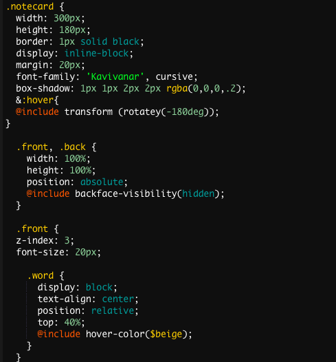
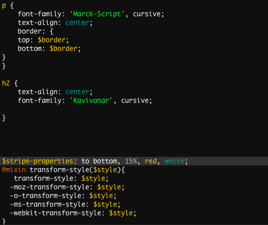

# Entry 8: So Close yet so Far
For this week, I focused a lot on my SCSS. I wanted to make sure I had my code down and ready since it is the main focus of my project. My downfall towards the end of the week however was not checking what it actually looks like on my page. I noticed that my changes were not appearing on the page and I started to panic a little bit, I thought to myself maybe it is because the output is not reading correctly. So, I went back to another blog that had information on how the program watches for the output and I put in this line of code into my command line: ```-sass --watch input.scss:output.css ```. I recieved some kind of error message, so I took out the ``` --watch``` and tried again. Still, it did not work. I had so many ideas on how I wanted my page to look and I tried to incorporate interactivity as well. In my SCSS file, I have included topics such as variables, nesting, and mixins. So far, this is what some of my SCSS code looks like: 



## Next Steps
1. Ask friends and teacher for help with making my stylesheet appear on my page so that for the rest of the week I can focus on my presentation. 
2. Make any last edits I need to do to make my page look the way I want it to. 

## Takeaways
+ ALWAYS check your work. I usually do this, but I became too encapsulated in making my code trying to perfect it and it only set me back in the end. 
+ Ask your friends for help. Remember there are several people who are doing the same topic as you. Use them to your advantage. 


[Previous](../entries/entry07.md) |  [Next](../entries/entry09.md)

[Table of Contents](../README.md)