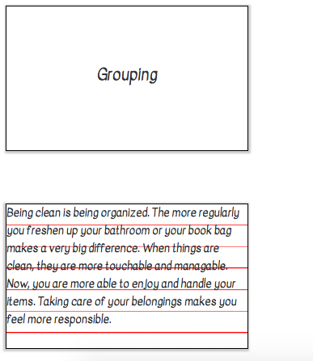
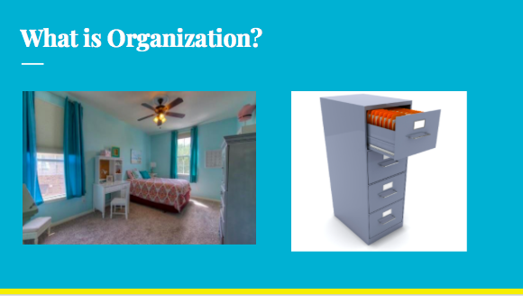

# Entry 9: My Finished Product/Presentation
This final week was filled with frustration and relief. At the beginning of the week, I was still working on my product. I had one small issue that I could not fix. When I finally found the issue, I was releived. The SCSS code to my project was finally being added on to my page. 

## Final Product 
While the page that I created could be much better, I am happy with what I created. Since it took me so long to figure out the bug in my code, I did not really have time to fix anything that might be a little off. A few things I want to change is the font size, the lack of color, and how the note cards are placed. But, I am happy that I was able to finally get an MVP that at least shows how SASS can work. The image below is an example of how the note cards I created with SASS look like:

## Presentation
I did not start working on my presentation until towards the middle/end of the week. With creating a presentation/slides, I keep three things in mind:
1. Organization/Sequence: The ideas of my presentation are clearly flowing into eachother (my thought process from beginning to end)
2. Getting my point across
3. Being minimalist with my slides because most of the information comes from me talking (only visuals and some bullet points)
Creating a presentation is hard especially after you create/learn something on your own. It is hard to know where to start explaining. The one thing I am keeping in mind when I am doing the talking portion of this presentation is make references. With the topics I learned, most people do not know what it is, so by comparing it to something else or by using "human" language rather than code language, I will be more successful with teaching/presenting to people what I learned. This is an example of one of my slides for my presentation: 

For this slide, I only have pictures up because they are visuals for my audience. These pictures help me because they tell me what I have to talk about. For example when I see these pictures, I will rhetorically ask the class if that is what they think about when they think of organization. This will all lead up to how SASS is just a way to organize CSS in a way to make it efficient. 

## Next Steps
1. Practice my pressentation in front of people. (Time it)
2. Continue to fix my page to make it look a bit more detailed. 

## Takeaways
+ ASK YOUR FRIENDS/PEERS FOR HELP! This tip is what saved me. People can see things or catch things that you might not always notice. If you are stuck and need help, do not be scared to ask.

[Previous](../entries/entry08.md) 

[Table of Contents](../README.md)